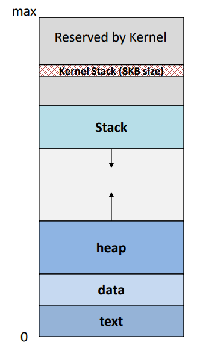
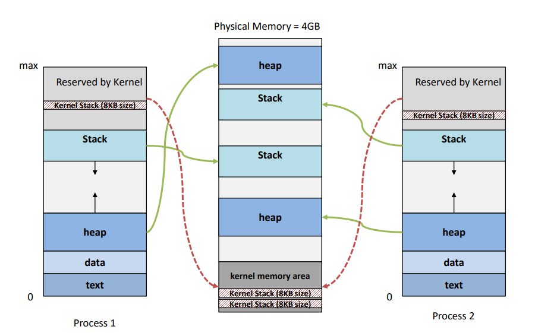
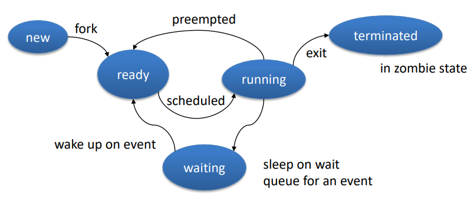
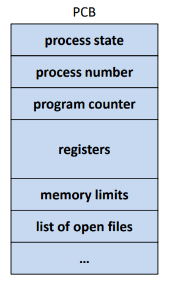
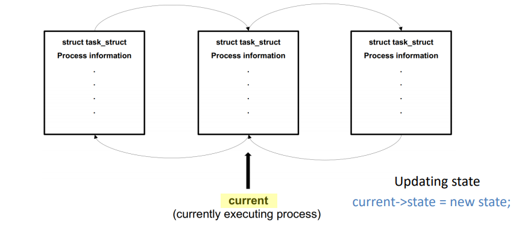

# CH3. Process

---

## 1. Concepts of Process

---

1. 프로세스 : 
    1. **실행 중인 프로그램(text segment) or binary file**
    2. 작업의 단위 (**Unit of work**)
    3. job, task (프로세스와 같은 말)
2. 왜 프로세스라는 개념이 필요한가?
    1. 프로그램과 구별하고, 어디서 왜 언제부터 실행중인지 나타내기 위해 필요하다
3. 프로세스를 나타내는 것
    1. 현재 명령어(Current Instruction) : **PC(Program Counter)**
    2. **Register State** → (EAX, EBX, ECX ⇒ General purpose register → CPU 아키텍쳐에 따라 다름)
    3. **Memory contents** (Stack, Heap, Global variables)→레지스터와 다름(메모리에 존재)
    4. **Parent info**
4. Program is **Passive(수동적)**, Prcocess is **Active(능동적)**
5. 한 프로그램에 대한 **하나 이상의 프로세스**가 존재할 수 있다.

## 2. Process Memory Layout

---

    

- 각각의 프로세스는 자신이 자신만의 메모리 레이아웃이 있다고 생각한다.
    - Virtual memory layout
- **Stack Area**
    - **함수 호출(function called)** 때 마다 아래로 증가(grows downward)
- **Heap Area**
    - **동적할당**(dynamic memories)이 요청 될 때 마다 위래 증가(grow upward)
        - malloc() (brk() system call) (libc)
        - brk()는 뻥 뚫린 빈공간을 찾아 할당해줌
- **Data segment**
    - **전역 변수(Global variables)**가 초기화/ 초기화해제 될 때 사용
- **Text segment**
    - CPU 아키텍처에 따라 다르며 32bit인 경우,
        
        $$
        2^{32} = 4294967296 (=4GB)
        $$
        
    - Binary program **code**
        - abc.exe
        - **file**
- 따라서 32bit인 경우, 모든 프로세스가 가상의 32bit 메모리 space(4GB)를 가진다
- **Kernel Stack은 System call 또는 내부 함수 처리를 위해 사용된다.**
- stack과 heap 사이의 공간은 매우 커서 웬만하면 부딪히지 않지만, 부딪히게 된다면 프로그램이 멈추게 된다.

- 실제로 보면 여러 프로세스(스레드당)가 **커널 스페이스를 공유**하는 것이다.(Shared memory space)
- 무작위로 매핑되는 것은 아니다.
- 각 프로세스의 주소에는 real memory를 주지 않고, 실제 물리 메모리 주소로 매핑을 해 줄 뿐이다.

## 3. Process State (lifecycle)

---

- **New**
    - 프로세스가 막 생성된 상태
- **Ready**
    - 프로세서에 할당 되기를 기다리고 있는 상태 (준비된 상태)
    - Ready Queue 에 있음
- **Running**
    - Instructions 가 실행되고 있는 상태
    - 어느 순간에 하나의 프로세서(코어)에서는 하나의 프로세스만 실행가능 하다.
    - I/O request 발생 시 wait queue로 간다.
- **Waiting**
    - 어떠한 이벤트(특히, I/O 처리 완료 등)가 일어나길 기다리는 상태
    - Wait Queue에 있음
    - I/O 완료시에 Ready Queue로 간다.
- **Terminated**
    - 프로세스가 완전히 종료된 상태
    

## 4. Process(Task) Control Block(PCB)

---

- **PCB : Data Structure in kernel representing a process (프로세스를 나타내는 커널 내부의 자료 구조)**
- PCB 내부 정보:
    - **Process state(프로세스 상태)**
        - New, Ready, Running, Waiting, halted...)
    - **Program Counter(PC)**
        - Address of the Next instruction( 다음 명령어 주소)
    - **CPU register**
    - **CPU scheduling info**
        - 프로세스 우선순위, pointer to scheduling queue, scheduling parameters
    - **I/O status info**
        - I/O 디바이스 리스트
        - open files 리스트
    - **Memory-management info**
        - 기준(base) 레지스터와 한계(limit) 레지스터의 값, 페이지 테이블, 세그먼트 테이블
    - **Accounting Information**
        - CPU time usage
        - job, process number
            - pid(프로세스에 부여된 번호) 등

- 리눅스에서는 Struct **task_struct**라는 구조체로 PCB를 나타낸다.
- 해당 구조체는 **dubling linked list**로 서로 서로 연결되어 있다.
- **current라는 포이터가 현재 실행 중인 프로세스를 가리키고 있다.**
- state를 업데이트 하기 위해선
    - current→state = new state;
- 즉, 컨텍스트 스위치가 일어나면 **가리키는 포인터가 바뀌는 것**이다.

## 5. Thread

---

- **Single sequence of execution**
- 각각의(분리된) PC, register states, stack area를 가짐
- DATA, FILE, CODE는 공유함
- 리눅스에서 스레드가 **실제 스케줄링 entity**임
- 하나의 프로세스는 하나 이상의 스레드를 가짐
- CH4 에서 자세히 적음

## 6. Process Switch

---

- P0 실행 중 어떠한 이벤트(interrupt) 발생 시에 커널 모드에서 PCB0가 저장되고 PCB1이 불러와져 P1 프로세스가 실행된다.
- **스위칭** 하는 것은 **커널모드**에서 진행된다.
- **OS라는 특정한 경계(구분)가 없고**, 즉, **모든 프로세스가 OS가 될 수 있**으며 **커널 부분을 실행**하면 OS 가 되는 것이다.
- OS가 할일이 생겨 **syscall handling**을 해야하면 프로세스가 **무엇이든 멈추고** OS가 일을 하고 난 뒤에 다시 실행된다.

## 7. Process Scheduling

---

- **Multiprogramming**
    - 의미 : **여러 프로그램을 동시에 실행** 시키는 것, 특정 프로세스가 입출력 작업을 하는 동안 대기되는 낭비되는 시간에 다른 프로세스를 실행하는 것
    - Goal : To **maximize the CPU utilization**
    - Why? : sequentially 하게 운영한다면 **wait(대기시간)이 많이 발생하여 CPU가 낭비**된다.
- **Time-sharing**
    - 의미 : **각 프로세스마다 시간(time slice)을 부여해서 계속 스위칭**하는 기법이다
    - 시간을 분할하여 사용하는 기법
    - **response time이 매우 짧아져 사용자와 상호작용**이 가능하다
    - Goal : To make **processes interactive**
- Process Schduling
    - 프로세서에서 다음에 실행될 프로세스를 골라주는 것
- Scheduling Queues
    - **Job Queue**
        - 모든 프로세스들(PCBs)
    - **Ready Queue**
        - 프로세서에서 실행될 **준비를 마친** 모든 프로세스들
        - PCB들의 **linked list**로 구현되어 있음
    - **Device Queue (Wait Queue, I/O queue)**
        - I/O device를 기다리는 프로세스들의 목록
        - 각각의 디바이스가 **자신만의 Queue**를 가지고 있다.
        - why? **프로세스들의 한번에 데이터에 접근하려고 할 때 발생하는 chaos를 해결할 수 있다.**

## 8. Scheduler

---

- 스케줄러는 몇가지 policy에 따라 큐에서 프로세스를 고른다
- **Long-term scheduler** = job scheduler
    - Ready Queue에 프로세스를 적재하는 스케줄러
    - (이론으로만 존재)
- **short-term scheduler** = CPU scheduler
    - ready Queue에서 프로세스를 골라 **CPU에 할당**해주는 것
- Type of processes
    - **I/O-bound**
        - 대부분의 시간을 I/O 요청을 처리하는데 보내는 프로세스
        - CPU burst에 비해 I/O burst가 큰 경우
    - **CPU-bound**
        - 대부분의 시간을 CPU를 사용해 작업하는데 사용하는 프로세스
        - I/O burst에 비해 CPU burst가 큰 경우
- **Long-term Scheduler는 반드시 I/O-bound와 CPU-bound jobs들의 좋은 조합을 선택해야만 한다.**
    - 이유 : **CPU, I/O 의 utilization을 모두 최대화 하기 위해서, 즉 낭비되는 자원이 최대한 적어지도록 하기 위해서** 이다
    - 만약 모든 프로세스가 I/O bound 라면, ready queue가 거의 비워질 것이고, short-term scheduler는 할 일이 거의 없어지게 된다
    - 만약 모든 프로세스가 CPU-bound 라면, I/O waiting queue가 거의 항상 비워질 것이고, 디바이스들은 사용되지 않아질 것이고, 따라서 시스템은 unbalanced 하게 될 것이다.
- Scheduling Criteria : many options possible
    - Maximize CPU utilization
    - minimize the average waiting time
    - minimize the response time
    - fairness
    - 5단원에서 조금 더 자세히 다룰 예정

## 9. Context Switch

---

- Context
    - Process state stored in PCB
- Context Switch
    - **현재 프로세스 상태를 save하고 다른 프로세스 상태를 restore하는 것**
    - 현재 CPU에서 실행되고 있는 프로세스(Context)를 바꾼다.
    - 실행 중이 프로세스의 상태를 보존하고 새로운 프로세스의 상태를 CPU에 적재하는 과정
- Context switch must be fast
    - context switch를 하는 동안 유의미한 작업이 불가능
    - time은 CPU마다 다양하다
    - **너무 자주하면 overhead가 커지게 된다**
- H/W support가 context switch time을 줄이는데 도움을 줄 수 있다
    - **multiple register set**에서는 그냥 간단하게 **포인터만 바꿔주면 된다.**
        - 장점 : 저장, 복사를 안해도 되기 때문에 **overhead가 줄어든다**
        - 문제점 : **set이 작으면 switch(저장, 복사)를 피할 수 없게 된다.**

## 10. Operation on Processes

---

- Process Creation (프로세스 생성)
    - Parent process, child process
        - **tree 구조체**를 형성
    - Process identifier: PID
        - 프로세스를 구분하는 uniquely한 정수
    - The init process (pid = 1)
        - 모든 프로세스들의 Root Parent process

- daemon process : **커널이 실행되는 동안 계속해서 실행되고 있는 백그라운드 프로세스이다.**

- Resource on process creation
    1. Child가 **추가 메모리(additional memory)**를 획득하는 방법
    2. Child가 부모의 자원의 **하위 집합(subset)**으로 여기는 방법
        - 프로세스가 시스템을 **overloading하는 것을 막아준다**
- On creating a new child process
    - Execution type
        - 부모는 동시에 run할 것이다
        - 부모는 자식이 끝나기를 기다길 것이다
    - Program type
        - child는 부모의 exact copy 가 될 것이다.
        - child는 새로운 프로그램이 될 것이다.

## 11. Process creation in Unix/Linux

---

- **fork()** system call
    - 새로운 프로세스를 만들어준다
        - parent의 **exact copy**이다 (code, data 등)
        - fork() 이후에 부모와 자식은 **concurrently하게 실행**된다
        - 부모와 자식의 **return value 는 다르다.**
            - child ⇒ 0, parent ⇒ pid
- **exec()** system call
    - 프로세스의 메모리를 **새로운 프로그램으로 대체**한다.
        - totally reborn new program
        - **binary file을 메모리로 로드하고 실행한다.**
        - 모든 것이 reset 된다.
        - 이전에 무슨 프로그램이었는 모름
    - exec()는 **control를 return 하지 않는다**. 왜?
        - exec()를 부르기 전에 **control(current execution point)**가 어떤 부분을 가리키고 있었다면, exec() 호출 후에는 메모리가 모두 지워지고**(wipe out)** **control이 해당 프로세스의 처음 부분을 가리키게 되므로, 이전 execution point(control)을 반환하지 못하게 된다.**
        - 프로세스의 주소공간을 새로운 프로그램으로 덮어쓰기 때문에 exec() 시스템 콜은 오류가 발생하지 않은 한 제어를 반환하지 않는다.
- **wait()** system call
    - parent는 **child 가 종료(terminate)할 때 까지 wait()을 호출하여 기다린다.**

- **wait()** 호출 시
    1. **child가 이미 끝난(죽은) 경우** : wait() 호출 시에 즉시 return 해줘야 한다.
        
        → OS가 child의 exit status를 가지고 있다가 delay 없이 반환해준다.
        
    2. **child가 아직 실행 중인 경우** : parent가 기다려야 한다.
- **fork() 후에 exec()바로 호출**한다면, **메모리 copy한 의미 X**
    
    → **vfork(), clone()**으로 해결 가능
    

## 12. Process Termination

---

- Process invokes **exit()** to terminate
    - **status value를 parent에게 return**한다 (OS에 의해)
        
        →OS는 exit()을 호출한 프로세스의 부모가 누군지 안다.
        
        - succeed or error( 0 : success | 1, 2, 3 ... : failure)
    - **resource(momory, open files 등)이 released** 된다.(clean-up)
- Parent can **terminate** the child processes
    - child의 **리소스 사용**이 너무 **과할 때** ( ex: malloc() )
    - child의 작업이 더이상 **필요하지 않을 때**
        - 특정 파일을 여러 프로세스가 같이 찾을 때 한 프로세스에서 찾았다면 나머지 프로세스는 더 이상 찾을 필요가 없어진다.
    - **Parent가 종료중**이고 OS가 **Orphan(고아)**를 허용하지 않을 때 ⇒ policy
        - **cascading termination(연속적인 종료)**
            - 1st level, 2nd level, .... 모두 종료해야함
            - 부모의 자식, 그 자식의 자식, 그 자식의 자식 ... 모두 종료해야함
            - 즉, 부모 프로세스가 종료되면 해당 프로세스의 모든 child를 찾아서 종료해야한다.
- exit() can be called **explicitly or implicitly**
    - 일반적으로 종료된 경우 explicitly하게 하지 않아도 **OS가 암시적으로 exit을 해준다.**
- wait()
    - child 프로세스가 끝나기를 **wait(hold)**하기 위해 부모 프로세스에 의해 쓰인다
        
        
        
    - &status ⇒ **status의 포인터**를 보내 **pid를 return** 받는다(OS가 채워준다)
        
        → **누가 왜 종료되었는지** 알 수 있다.
        
    - **child가 먼저 종료**되었다면 **OS가 exit status를 hold**하고 있다.
        - **부모가 wait()호출 할 때까지 OS가 부모를 기다린다.**
            
            ⇒ **parent가 wait()을 호출한다는 보장이 없다**
            
            ⇒ **wait() 호출 안하면 OS가 계속해서 가지고 있다.**
            
- **Zombie**
    - **프로세스는 종료되었지만, 그 부모가 wait()을 아직 호출하지 않은 경우**
    - **return status를 계속해서 hold**하고 있다. (이미 죽은 child의 exit status)
        
        → 최소한의 정보(프로세스 ID, 프로세스 종료 상태 등)를 **release 못함**
        
    - **parent가 reclaim해야만 OS가 clear**할 수 있다.
- **Parent가 wait()을 영원히 안부른다면** 어떻게 될까?
    - **init 프로세스가 넘겨받아서(인수) 주기적으로 wait()를 invoke(호출)해준다.**
    - OS가 **status value를 release**할 수 있게 해준다.